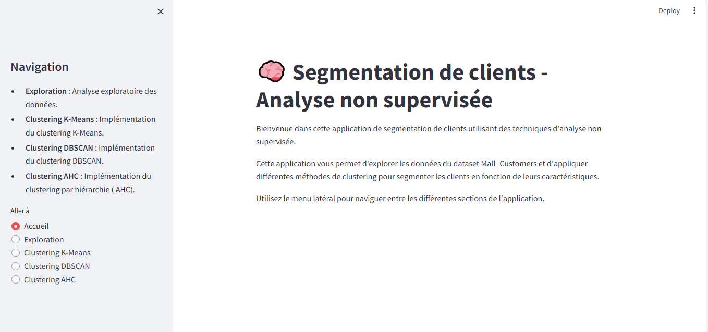
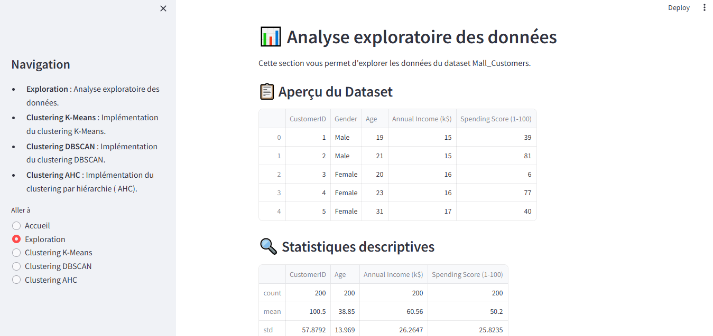
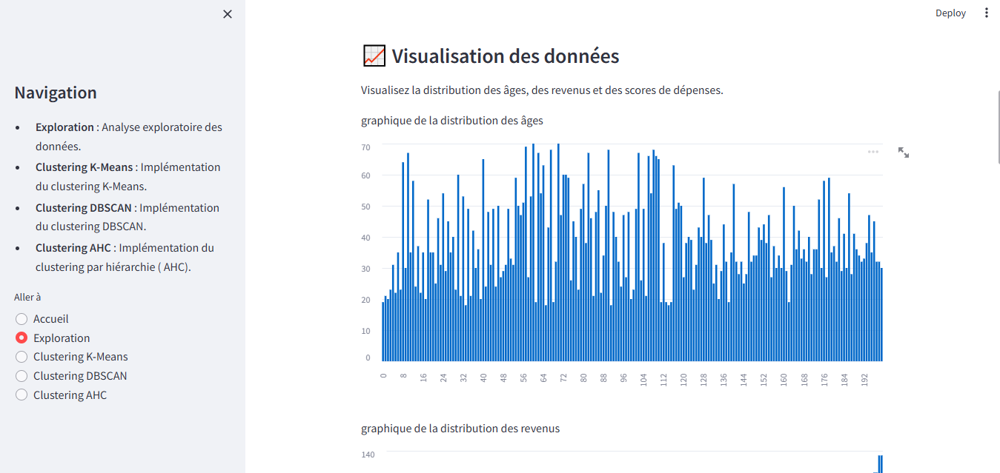
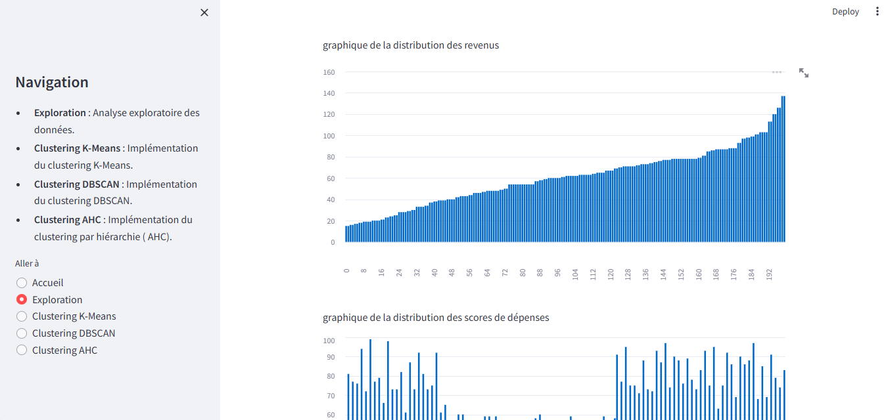
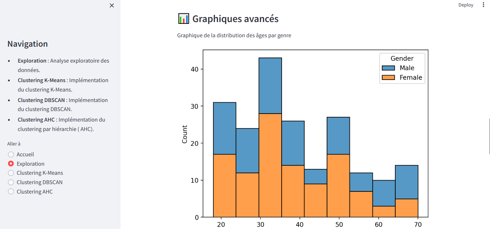
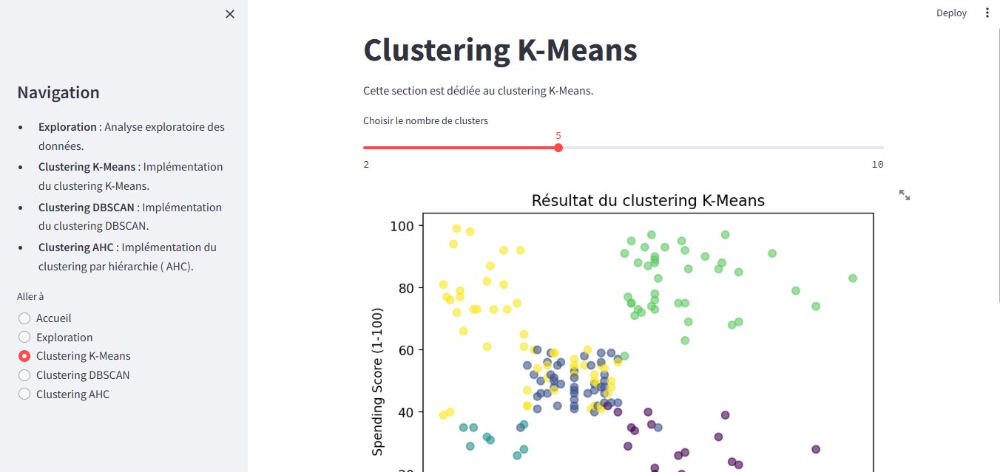
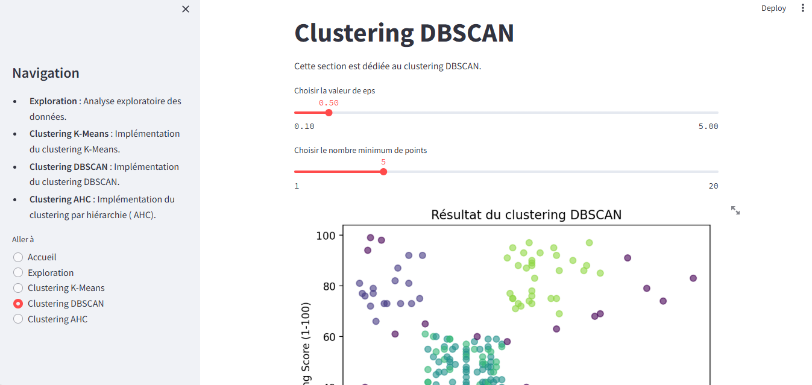
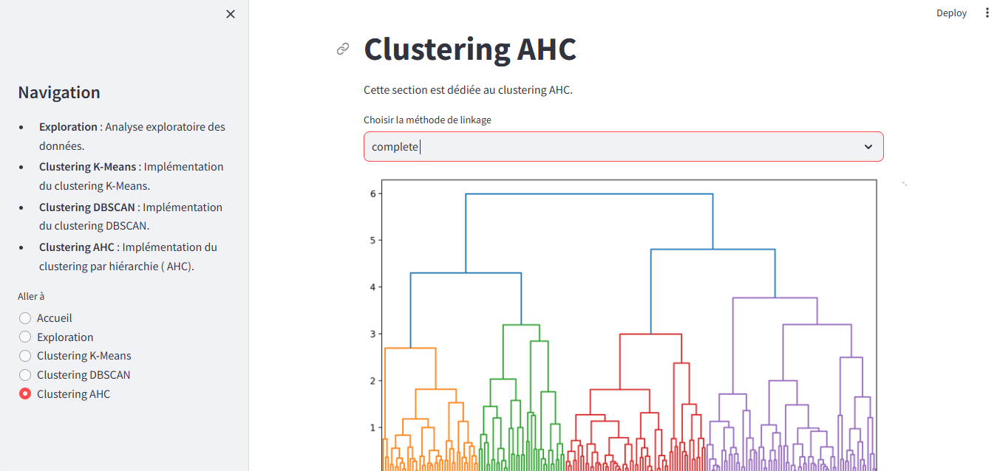

# 🧠 Customer Segmentation App

Ce projet est une application Streamlit interactive pour la segmentation de clients à partir du dataset Mall_Customers.csv.

## 📌 Fonctionnalités
- Analyse exploratoire des données (EDA)
- Clustering K-Means
- Clustering DBSCAN
- Clustering hiérarchique (AHC)
- Visualisations interactives avec Plotly et Matplotlib

## Aperçu de l'application

### Interface principale


### Exploration






### Clustering KMeans


### Clustering DBSCAN


### Clustering AHC



...


## 🚀 Lancer l'application

```bash
streamlit run app.py

